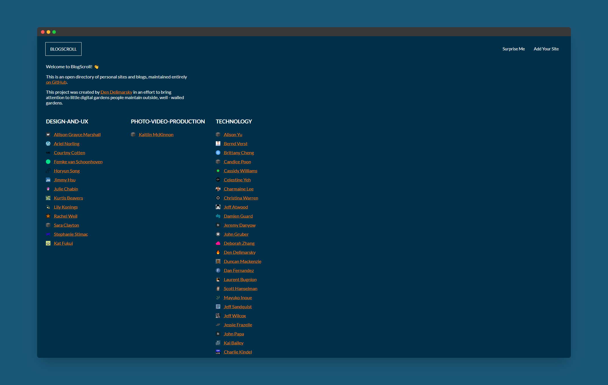

# 📜 BlogScroll

An open directory of personal sites and blogs, maintained entirely on GitHub.

## 🏗 What is this?

This project was created by [Den Delimarsky](https://den.dev/) in an effort to bring attention to little [digital gardens](https://maggieappleton.com/garden-history) people maintain outside, well - walled gardens. In the past year, I found that I really enjoy reading people's personal stories, and discovering their own corners of the Internet. However, as it turns out there is no one place that I can visit to see what people are building, so I decided to whip this page up myself.

This is a nice replacement for the bookmarks I have in my browser, all aggregated into the **People** folder in the bookmarks bar.

And it goes without saying that this site is work in progress - your feedback is [very much welcome](https://github.com/blogscroll/blogscroll/issues)!

## ❓ FAQ

### How did you come up with the initial list of sites?

I actually just moved my bookmarks to the web. That's it - that's the complicated logic I used to compile the initial list.

### Can I add any site?

Not quite. I am very intentional about this project being a directory of sites that people manage **within their own domains**. The goal is to create an environment for serendipitous discovery of digital gardens and personal pages that are outside the typical social media/newsletter aggregation sites.

Here is a simple (**yet not comprehensive)** breakdown of what may be approved and what may not:

#### ✅ OK to submit

- Sites hosted on common blogging services **with a custom domain attached**.
- Personal sites hosted on open-source services, like GitHub Pages (e.g., a page like `https://dend.github.io` is OK).
- Personal portfolios.
- Personal wiki sites.
- Self-hosted blogs.

#### 🛑 Not OK to submit

- Sites hosted on Blogger, LiveJournal, Substack, Medium, or any other service **without a custom domain attached**.
- Twitter, Facebook, LinkedIn, or other social media links.
- Links to companies or websites representing personal companies, whose primary purpose is to sell or promote a product.
- Sites that contain Not Safe For Work (NSFW) material (e.g., nudity, gore, disturbing imagery). While we're all adults here, the directory is designed to be fit for consumption anywhere (home, workplace, school, public transit). It would be a very unpleasant surprise to randomly stumble across content that may be classified as inappropriate just by clicking a blog link.
- Sites that contain or allude to hate speech, abuse, or otherwise harmful material.
- Sites that have a primary purpose other than being a personal page (e.g., podcasts, streaming pages, project pages).

>[!WARNING]
>Any sites that are found to be in violation of these guidelines _even after submission_ will be removed with no notice, and there's a good chance that you won't be able to submit more pages in the future.

Lastly, and I want to spell this out directly - I reserve the right to not include or publish any site on BlogScroll. Because this is _my_ project, I get to choose how I curate it.

### Can I remove my site from the list?

Absolutely. [Open an issue](https://github.com/blogscroll/blogscroll/issues) or [create a pull request](https://github.com/blogscroll/blogscroll/pulls).

### Can I remove someone else's site?

Not really. Short of that site being no longer available, or hosting abusive, harmful, or inappropriate content, you can only remove the site that you manage or previously added.

### A site is no longer active/returns a 404. Can it be removed?

Totally. [Open an issue](https://github.com/blogscroll/blogscroll/issues) or [create a pull request](https://github.com/blogscroll/blogscroll/pulls) - I'll help fix the issue.

### A site seems to be hosting questionable content. What should I do?

You're probably sick of hearing this, but [open an issue](https://github.com/blogscroll/blogscroll/issues) or [create a pull request](https://github.com/blogscroll/blogscroll/pulls) - I'll help fix the problem.

### I don't like the categories that are laid out. Can I change them?

The categories are by no means final, so if you have a suggestion on how to make those better, [open an issue](https://github.com/blogscroll/blogscroll/issues) first. **Do not submit a pull request** until you have an issue open, and it was agreed that the category makes sense.

### Can I put my blog into more than one category?

No. I am trying to keep the list fairly clean and simple, so your site can only be included in one category.

### Can I link to my social media instead?

No. Just personal sites, please.

### Can I include a link to my company/startup/business/consulting/project site?

Same as above - just personal sites, please.

### I want to create a pull request and add my site. What do I do?

Fork the repository, then add a new TOML entry for your site in the [`categories`](https://github.com/blogscroll/blogscroll/tree/main/web/data/categories) folder, in the respective `list.toml` file.

Basically, you need three data points - the URL, name of the person who the site belongs to, and a link to the favicon. The identifier for the site (in square brackets) should be the blog apex domain, with spaces and dashes removed.

### Can I submit more than one site?

No. To give everyone a fair level of exposure, I will only accept one URL per individual. If you own several sites, pick the one blog that you feel represents you the best or is the most interesting for an audience to discover. Keep in mind that it still needs to be a _blog_ - this is not a site to promote other projects.
